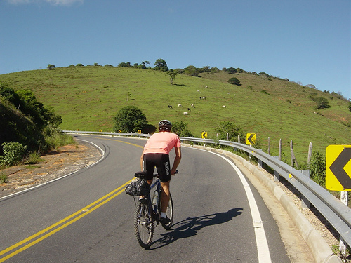
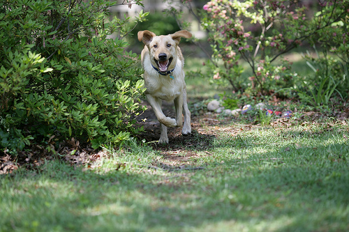
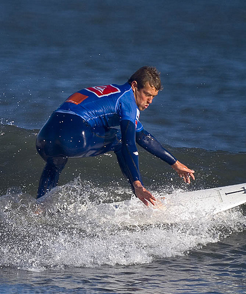
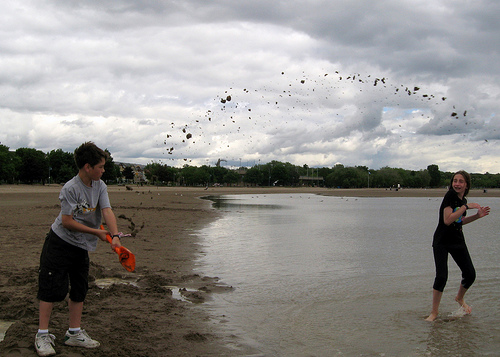
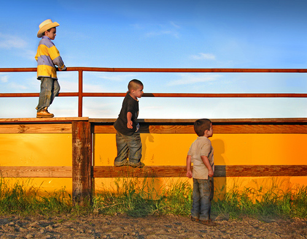

# Image Captions Generator

Generate captions from images 

## Table Of Contents

1. [Background](#1-background)
2. [How to use this repository](#2-how-to-use-this-repository)
3. [Results](#3-results)
4. [Inferences](#4-inferences)
5. [Examples](#5-examples)
6. [References](#6-references)

## 1. Background

### 1.1. Why caption images

Image captions serve as a link between the information stored in image and the text. It helps machine learning algortihms to make better sense of what's going on in the image. It is useful for Seach Engine Optimization (SEO), indexing and archiving photos based on its contents such as actions / places / objects in it (similar to what Google Photos does today). Image captioning can also help to process videographic data by identifying what's happening frame by frame.

### 1.2. Model architecture

Here we are using an attention based encoder-decooder model to generate captions. Training images available in RGB format are passed through a pre-trained encoder model to obtain spatial information from images, which are then passed through a decoder block to generate the captions sequentially. Encoder is most oftenly a pre-trained CNN model, here we are using InceptionV3 and decoder is a RNN model. 

### 1.3. Why use attention ?

Attention in literal English means directing focus at something or taking greater notice. In Deep Learning, attention mechanism lives off the same concept where a model pays higher focus on certain factors while processing the data. Attention in an encoder-decoder model is in charge of managing and quantifying the dependence that the decoder has on the encoder. See [[6]](#6-bahdanau-attention) for more details on Bahdanau Attention.

## 2. How to use this repository

### 2.1. Requirements

* Create a conda environment using following command: 
`conda create --name <_yourenvname_> python=3.7`
In case you are not familiar with conda environments, refer to [[3]](#3-getting-started-with-python-environments-using-conda) and [[4]](#4-create-virtual-environments-for-python-with-conda) to get started.

* Install dependencies using [requirements.txt](requirements.txt) 
`pip3 install -r requirements.txt`

* Flickr8k images have been used in this project. There are multiple sources available online to download this dataset, here is one of them - [download flickr8k](https://www.kaggle.com/adityajn105/flickr8k). Save these images in [data/Flicker8k_Images](data/Flicker8k_Images) directory. One image has been already saved for reference.

* Instead of creating the train-test-val split by ourselves, we'll leverage the awesome work done by Andrej Karpathy to split the images into train-val-test in ratio  6000:1000:1000 alongwith segregating their captions. This is available as json, download from [here](https://www.kaggle.com/shtvkumar/karpathy-splits?select=dataset_flickr8k.json). Save this json file in [data/annotations](data/annotations)

* Download pretrained GLoVe embeddings (glove.840B.300d) from [here](https://nlp.stanford.edu/projects/glove/) or [here](https://www.kaggle.com/takuok/glove840b300dtxt) and save to [data/annotations](data/annotations) directory

* Run [img_features.py](img_features.py) to save the encoded version of images into the disk. This usually takes 30-35 mins for images in train and validation set, so better to perform this step one-off before kicking off training. Saving to disk would allow us to use these encoded features repeatedly without any time expense as we try different combinations of model parameters. A folder named 'img_features' would be created inside [data/](data) folder.

### 2.2. Configure settings

Specify following settings in [config.yaml](config/config.yaml). These are used to control how the model is trained. 

* **store**: specify folder name where the model checkpoints and results will be saved. A good practice is to name this folder according to settings used, for example, number of epochs, vocab_size, RNN units etc 
* **epochs** Number of cycles where all training data is passed through the model exactly once. A forward pass and a backward pass together are counted as one pass 
* **batch_size:** An epoch is made up of one or more batches, where we use a part of the dataset to train the neural network. Training data is split into batch_size and model weights are updated once per batch 
* **units:** Number of units in the decoder RNN 
* **embedding_dim:** Size of the feature vectors of the word embedding being used. Glove word vectors have 300 dimensions 
* **vocab_size:** Number of unique words in the training set. A feature vector per word is sourced from Glove embeddings, and a zero vector is assigned to out of vocabulary words 

### 2.3. Training and Inference

* In the preprocessing step, [tensorflow.keras.preprocessing.pad_sequences](https://www.tensorflow.org/api_docs/python/tf/keras/preprocessing/sequence/pad_sequences) is used to ensure length of all training captions are same, by setting 'maxlen' parameter. We have set maxlen to be 21, which is equal to {average(length of training captions) + 2*standard deviation(length of training captions)}. Keeping max_len = 39 (longest caption in train) leads to spurious results where the algorithm wanders between random words in search of stopping criteria .ie. to arrive at maxlen.

Point to note here is that only 2.2% training captions are longer than 21 words, so it does not make sense to train for full length.

    

* At this point, we are ready with all settings to begin the training. Kick-off training by running [main.py](main.py).

* Here are the losses per epoch for training and validation sets. While the training loss decreases as training progresses, there is a hint of overfitting as the validation loss increases after an initial dip.

    

* At the end of training, there will be two folders creared within the 'store' folder that you specified in [config.yaml](config/config.yaml)
    - checkpoints: contains a single checkpoint for the epoch with least training loss
    - derived_data: has following .csv files: 
        - loss_per_epoch.csv: contains train_loss and validation_loss per epoch. Used to plot above figure.
        - pred_cap_per_epoch.csv: contains predicted caption for a sample image after every epoch
        - result_train_greedy.csv: contains predicted captions and BLEU-1,2,3,4 scores for all samples in training data, alongwith actual captions provided in Flickr8k dataset. Uses greedy search to generate captions.
        - result_val_greedy.csv: same as above but for validation samples using greedy search
        - result_val_beam.csv: same as above but for validation samples using beam search

We compute BLEU scores for both training and validation set, using two methods to generate predicted captions: Greedy Search and Beam Search

* Greedy Search: In order to predict next word in caption, the decoder predicts probability scores of all words in the vocabulary. In Greedy search, we pick the best probable word at every instance and feed it into the model to predict next word. 

* Beam Search: Beam search is different from Greedy Search as it preserves top-k predicted words at each instance, and feed them individually to get the next word, thus maintaining atmost k sequences at each instance. This is done to reduce the penalty in case the highest probable word at any instance lead into a wrong direction. See Andrew NG's video [[5]](#5-andrew-ngs-explanation-of-beam-search) for better understanding beam search. Please note that if k=1 in beam search it is nothing but greedy search.
 

## 3. Results

Below table summarizes the performance of various model settings.

| # 	| epochs 	|  vocab_size 	| max_len 	| rnn_units 	|                                               Greedy Search                                              	|                                             Beam Search (k=3)                                            	|
|:-:	|:------:	|:-----------:	|:-------:	|:---------:	|:--------------------------------------------------------------------------------------------------------:	|:--------------------------------------------------------------------------------------------------------:	|
| 1 	|   40   	| Full (7378) 	|    39   	|    256    	| Dev set BLEU scores:  - BLEU-1: 0.4044 - BLEU-2: 0.2131 - BLEU-3: 0.0792 - BLEU-4: 0.0234 	| Dev set BLEU scores:  - BLEU-1: 0.4259 - BLEU-2: 0.2284 - BLEU-3: 0.0962 - BLEU-4: 0.0358 	|
| 2 	|   40   	|     6000    	|    39   	|    512    	| Dev set BLEU scores:  - BLEU-1: 0.4280 - BLEU-2: 0.2275 - BLEU-3: 0.0823 - BLEU-4: 0.0241 	| Dev set BLEU scores:  - BLEU-1: 0.4255 - BLEU-2: 0.2261 - BLEU-3: 0.0888 - BLEU-4: 0.0290 	|
| 3 	|   20   	|     6000    	|    39   	|    512    	| Dev set BLEU scores:  - BLEU-1: 0.4531 - BLEU-2: 0.2581 - BLEU-3: 0.1022 - BLEU-4: 0.0326 	| Dev set BLEU scores:  - BLEU-1: 0.4620 - BLEU-2: 0.2646 - BLEU-3: 0.1157 - BLEU-4: 0.0393 	|
| 4 	|   20   	| Full (7378) 	|    39   	|    512    	| Dev set BLEU scores:  - BLEU-1: 0.4548 - BLEU-2: 0.2560 - BLEU-3: 0.1183 - BLEU-4: 0.0400 	| Dev set BLEU scores:  - BLEU-1: 0.4547 - BLEU-2: 0.2711 - BLEU-3: 0.1301 - BLEU-4: 0.0466 	|
| 5 	|   20   	| Full (7378) 	|    21   	|    512    	| Dev set BLEU scores:  - BLEU-1: 0.4745 - BLEU-2: 0.2776 - BLEU-3: 0.1219 - BLEU-4: 0.0398 	| Dev set BLEU scores:  - BLEU-1: 0.4855 - BLEU-2: 0.2900 - BLEU-3: 0.1359 - BLEU-4: <u>0.0523</u> 	|
| 6 	|   20   	| Full (7378) 	|    17   	|    512    	| Dev set BLEU scores:  - BLEU-1: 0.4706 - BLEU-2: 0.2678 - BLEU-3: 0.1114 - BLEU-4: 0.0339 	| Dev set BLEU scores:  - BLEU-1: 0.4776 - BLEU-2: 0.2739 - BLEU-3: 0.1232 - BLEU-4: 0.0412 	|

The best performance was acheived in run #5, with a BLEU-4 score of 5.23% using beam search.

* Here is how the model learnt captions for a sample image shown below:

| Image 	|                                                                                                                                                                                                                                                                                                                                                                                Intermediate Predicted Caption at each Epoch                                                                                                                                                                                                                                                                                                                                                                                	|
|:-----:	|:----------------------------------------------------------------------------------------------------------------------------------------------------------------------------------------------------------------------------------------------------------------------------------------------------------------------------------------------------------------------------------------------------------------------------------------------------------------------------------------------------------------------------------------------------------------------------------------------------------------------------------------------------------------------------------------------------------------------------------------------------------------------------------------------------------	|
|      	| 1,a man on a bike on the street 2,a man on a bicycle 3,a man is riding a bicycle 4,a man is riding a bicycle down a street 5,a man on a bicycle 6,a man walks along a dirt road 7,a man is riding a bicycle down a road 8,a bicycle on a dirt bike 9,a man is driving a bicycle down a road 10,a man is riding a bicycle on a road 11,a man is riding his bike 12,a bicycle on a bicycle down a street 13,a bicycle wheel on a gravel road 14,a bicycle wheel bikes on a dirt road 15,a bicycle on a dirt road 16,a man is riding his bike covered road in a race 17,a man bicycle wheel 18,a bicycle wheel a bicycle moving down a curved pipe wall 19,a bicyclist on a curved road in the background 20,a man is riding a bicycle down a street 	|
|       	|                                                                                                                                                                                                                                                                                                                                                                                                                                                                                                                                                              

## 4. Inferences

* Training on a larger corpus of images could potentially improve performance. Since I have used Google Colab for training and have exhasuted the storage limit on Google Drive, I have used Flickr8k dataset, but we could upgrade to Flickr30k or COCO dataset for access to more training samples.

* Training for 40 epochs lead to overfitting on training data, so I had changed number of epochs to 20 from run #3. We have incorporated regularization techniques like L2 regularizer and Dropout but they do not seem to help after a certain degree.

* Training for full vocab size .ie. not dropping any words in training data lead to better performance.

* As mentioned above, keeping a low max_len lead to stable predictions.

* BLEU scores are better while using Beam Search as compared to Greedy Search. Increasing the beam width (currently 3) can further improve the performance marginally. However, considering more beam samples at every step would come at higher computation expense.

## 5. Examples

* Good Predictions:

| Image                     	| Predicted Caption                       	| Human Annotated Captions                                                                                                                                                                                                                                                                   	|
|:---------------------------:	|:------------------------------------------:	|:--------------------------------------------------------------------------------------------------------------------------------------------------------------------------------------------------------------------------------------------------------------------------------	|
|  	| a brown dog is running through the grass 	| <ul><li>a beige dog runs through the shrubbery toward the camera,</li><li>a blond dog runs down a path next to a rhododendron,</li><li>a brown dog is running through a wooded area,</li><li>the dog is running through the yard,</li><li>the yellow dog is running next to a bush on a path in the grass</li></ul> 	|
|  	| a man in a wetsuit is surfing            	| <ul><li>a man in a blue bodysuit surfing,</li><li>a man in a blue wetsuit rides a wave on a white surfboard,</li><li>a man in blue surfs in the ocean,</li><li>a surfer tries to stay moving on his white surfboard,</li><li>a surfer in a blue swimsuit is riding the waves</li></ul>                               	|

* Not so good predictions:

| Image                     	| Predicted Caption           	| Human Annotated Captions                                                                                                                                                                                                                                                                                                                            	|
|:---------------------------:	|:------------------------------:	|:-------------------------------------------------------------------------------------------------------------------------------------------------------------------------------------------------------------------------------------------------------------------------------------------------------------------------------------------	|
|  	| a boy is running on a beach  	| <ul><li>a boy and a girl at the beach, throwing sand,</li><li>a boy flings sand at a girl,</li><li>a boy with an orange tool on the shore is spraying a girl standing in shallow water with mud,</li><li>boy flings mud at girl,</li><li>the young boy flings mud at the barefoot girl in the pond</li></ul>                                                                   	|
|  	| two children jump in the air 	| <ul><li>the three children are standing on and by a fence,</li><li>three boys are standing in a row along an upraised wall and rail,</li><li>each a level higher than the one before,</li><li>three children stand on or near a fence,</li><li>three little boys, one wearing a cowboy hat look over a fence,</li><li>three little boys standing next to and on a fence</li></ul> 	|

## 6. References

#### 1. [Show, Attend and Tell: Neural Image Caption Generation with Visual Attention](https://arxiv.org/abs/1502.03044)
#### 2. [Tensorflow implementation of picture captioning with visual Attention](https://www.tensorflow.org/tutorials/text/image_captioning)
#### 3. [Getting started with Python environments using Conda](https://towardsdatascience.com/getting-started-with-python-environments-using-conda-32e9f2779307)
#### 4. [Create virtual environments for python with conda](https://uoa-eresearch.github.io/eresearch-cookbook/recipe/2014/11/20/conda/)
#### 5. [Andrew NG's explanation of Beam Search](https://www.youtube.com/watch?v=RLWuzLLSIgw)
#### 6. [Bahdanau Attention](https://towardsdatascience.com/sequence-2-sequence-model-with-attention-mechanism-9e9ca2a613a)

